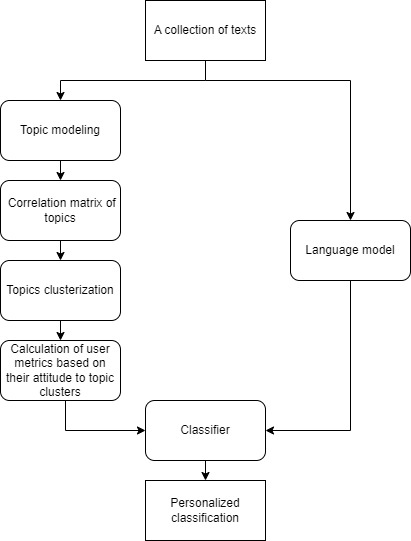

# personalized-hate-speech-recognition

## Abstract
Hate speech, that is, speech that contains elements that humiliate or ridicule others, is unfortunately
becoming more and more common, especially on the Internet. The serious effects it causes to those who are
exposed to it and its growing prevalence have led to a greater need for automated methods to detect it. Due to
the subjective nature of hate speech, personalised methods, which take into account the individual sensitivity
of the user, work exceptionally well in its detection. However, there are currently not many such methods.
This thesis (and repository) proposes a new method for personalised hate speech detection. This new method innovatively
uses the users’ modelled attitudes to different groups of topics, to perform a personalised classification of
potentially aggressive content. The advantage of the proposed method is the easy process of adaptation to the
individual preferences of the users. The method has been tested and compared with other existing methods
for this task on the Wikipedia Talk Labels: Aggression dataset. The results obtained by the new method do
not differ significantly from existing solutions and are definitely better than the generalisation method, which
does not use personalization.

## Proposed new method for personalized hate speech recognition

The method begins its operation with topic modeling carried out on a corpus of texts characteristic for the specificity of the language for which it will perform the later classification. In the case of using it on a prepared dataset, it can be a corpus composed of combined training and validation sets.

On such a corpus of texts, the BERTopic model performs topic modeling and
discovers certain abstract topics that occur in the corpus. Then, each text, from the entire dataset (including the test dataset), is assigned to a certain, most
likely topic.

Once each text from the collection has a topic assigned to it, a co-occurrence matrix of different topics is calculated based on the combined training and validation set. Co-occurence is calculated in terms of the occurrence in topics content annotated as aggressive by the same person. The purpose of the matrix is thus to assign high values for pairs of those topics that are often considered aggressive by the same individuals. This matrix, is a square matrix, with a size of one side equal to the number of topics discovered in the topic modeling stage. The matrix is determined in one of two versions: micro or macro.

Based on the data from the matrix, clustering of topics is then carried out. Its purpose is to to gather into clusters those topics that are often marked as aggressive by the same people. The algorithm used for this is one of a trio: DBSCAN , HDBSCAN or k-means. For k-means algorithm, various metrics are used to assess the quality of clustering, to choose the optimal number of clusters for a given dataset. The other two methods (DBSCAN, HDBSCAN) determine this
number automatically. Each text from the dataset is then assigned to one of the determined clusters.

In a further step, user sensitivity measures are calculated. For each user, based on
his annotations on the validation set, an individual measure representing
his sensitivities separately for each topic cluster determined in the previous stage. This measure can be calculated in one of three proposed ways (SA, SPA, SOPA). User measures for each cluster, are then concatenated into a single vector that represents its individual sensitivity.

Each text from the dataset is then converted into an embedding vector, using an arbitrary language model. Within this work, the pre-trained fastText model was used. For each vector embedding text is concatenated with a vector representing the user for whom the classification is made. The final vector is fed as a input to the classifier. 

In this way, classifer takes into into account for whom the classification is performed and performs it in a personalized way. At this stage, any classifier can be used. Within the framework of this work, logistic regression and a neural network were tested.

## Method architecture

## Files structure

- src/classification - deep learning classification 

- src/preprocessing:
    - 1_topic_modeling.ipynb -> basic preprocessing + topic modeling + topics analysis
    - 2_clustering.ipynb -> topics clustering + matrix correlation + clustering analysis
    - 3_metrics_and_modeling.ipynb -> user_metrics + logistic regression classification 

## Experiments
To run experiments:

`python grid_search.py`